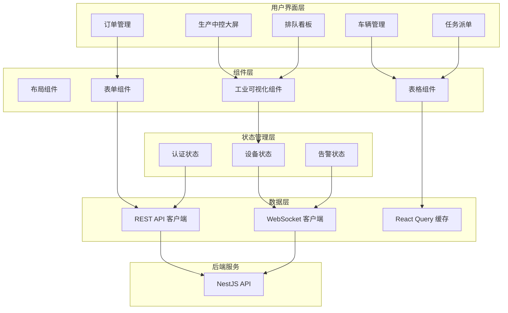

# Design Document: 混凝土搅拌站管控平台前端

## Overview

本设计文档描述混凝土搅拌站数字生命管控平台前端的技术架构和实现方案。系统采用 React + TypeScript 构建，使用工业风格深色主题，支持实时数据可视化。

### 技术栈选型

- **框架**: React 18 + TypeScript 5
- **构建工具**: Vite
- **UI 组件库**: Ant Design 5 (深色主题)
- **状态管理**: Zustand
- **数据请求**: TanStack Query (React Query)
- **实时通信**: Socket.io-client
- **图表库**: ECharts + echarts-for-react
- **路由**: React Router 6
- **样式**: Tailwind CSS + CSS Modules
- **工业组件**: 自定义 SVG 组件 (仓体、管道、阀门等)

## Architecture

### 前端架构图



### 目录结构

```
concrete-plant-web/
├── src/
│   ├── api/                    # API 客户端
│   │   ├── client.ts           # Axios 实例配置
│   │   ├── auth.ts             # 认证 API
│   │   ├── vehicles.ts         # 车辆 API
│   │   ├── orders.ts           # 订单 API
│   │   └── tasks.ts            # 任务 API
│   ├── components/
│   │   ├── layout/             # 布局组件
│   │   │   ├── AppLayout.tsx
│   │   │   ├── Sidebar.tsx
│   │   │   └── Header.tsx
│   │   ├── industrial/         # 工业可视化组件
│   │   │   ├── AggregateBin.tsx
│   │   │   ├── CementSilo.tsx
│   │   │   ├── Mixer.tsx
│   │   │   ├── Scale.tsx
│   │   │   ├── Tank.tsx
│   │   │   ├── Pipe.tsx
│   │   │   └── Valve.tsx
│   │   ├── common/             # 通用组件
│   │   │   ├── StatusBadge.tsx
│   │   │   ├── AlarmNotification.tsx
│   │   │   └── ConnectionStatus.tsx
│   │   └── forms/              # 表单组件
│   ├── pages/
│   │   ├── Login.tsx
│   │   ├── Dashboard.tsx       # 生产中控大屏
│   │   ├── Vehicles.tsx
│   │   ├── Drivers.tsx
│   │   ├── Orders.tsx
│   │   ├── Tasks.tsx
│   │   └── Queue.tsx
│   ├── stores/                 # Zustand 状态
│   │   ├── authStore.ts
│   │   ├── plantStore.ts
│   │   └── alarmStore.ts
│   ├── hooks/                  # 自定义 Hooks
│   │   ├── useWebSocket.ts
│   │   ├── useAuth.ts
│   │   └── usePlantStatus.ts
│   ├── types/                  # TypeScript 类型
│   ├── utils/                  # 工具函数
│   ├── styles/                 # 全局样式
│   │   └── industrial.css      # 工业风格样式
│   ├── App.tsx
│   └── main.tsx
├── public/
│   └── assets/
│       └── sounds/             # 告警音效
├── index.html
├── vite.config.ts
├── tailwind.config.js
└── package.json
```

## Components and Interfaces

### 1. 工业可视化组件

#### 骨料仓组件 (AggregateBin)

```typescript
interface AggregateBinProps {
  id: string;
  name: string;
  specification: string;      // "5-10mm", "10-20mm"
  currentWeight: number;      // kg
  capacity: number;           // kg
  percentage: number;         // 0-100
  lowLevelAlarm: boolean;
  discharging: boolean;
  scale?: ScaleReading;       // 关联的称重斗
}

// 组件结构
const AggregateBin: React.FC<AggregateBinProps> = (props) => {
  // SVG 绘制梯形仓体
  // 动态填充高度表示库存
  // 底部出料口动画
  // 告警状态闪烁效果
};
```

#### 水泥仓组件 (CementSilo)

```typescript
interface CementSiloProps {
  id: string;
  name: string;
  materialType: string;       // "P.O 42.5", "矿粉"
  currentWeight: number;      // tons
  capacity: number;           // tons
  percentage: number;
  lowLevelAlarm: boolean;
  discharging: boolean;
}

// 组件结构 - 圆柱形仓体
```

#### 搅拌机组件 (Mixer)

```typescript
interface MixerProps {
  id: string;
  running: boolean;
  currentTime: number;        // seconds
  totalTime: number;          // seconds
  loadPercentage: number;
  dischargeGateOpen: boolean;
}

// 组件结构
// - 搅拌桶 SVG
// - 叶片旋转动画 (CSS animation)
// - 进度条显示
// - 出料门状态
```

#### 称重斗组件 (Scale)

```typescript
interface ScaleProps {
  id: string;
  name: string;
  materialType: string;
  targetWeight: number;
  actualWeight: number;
  deviation: number;          // percentage
  status: 'idle' | 'weighing' | 'complete' | 'error';
}

// 显示目标值、实际值、偏差
// 偏差超限时高亮警告
```

### 2. 布局组件

#### 生产中控大屏布局

```typescript
// Dashboard 布局结构
const DashboardLayout = () => (
  <div className="dashboard-container">
    {/* 顶部: 当前任务信息 */}
    <header className="task-info-bar">
      <CurrentTaskInfo />
      <ConnectionStatus />
      <AlarmIndicator />
    </header>
    
    {/* 主体: 设备布局 */}
    <main className="plant-layout">
      {/* 左侧: 骨料仓组 */}
      <section className="aggregate-section">
        <AggregateBinGroup bins={aggregateBins} />
      </section>
      
      {/* 中间: 水泥仓 + 外加剂 */}
      <section className="powder-section">
        <CementSiloGroup silos={cementSilos} />
        <AdditiveTankGroup tanks={additiveTanks} />
      </section>
      
      {/* 底部: 搅拌机 */}
      <section className="mixer-section">
        <Mixer {...mixerStatus} />
      </section>
    </main>
    
    {/* 右侧: 配方表 + 生产记录 */}
    <aside className="info-panel">
      <RecipeTable recipe={currentRecipe} />
      <ProductionLog records={recentRecords} />
    </aside>
  </div>
);
```

### 3. 状态管理

#### 设备状态 Store

```typescript
interface PlantState {
  connected: boolean;
  lastUpdate: Date | null;
  aggregateBins: BinStatus[];
  cementSilos: SiloStatus[];
  additiveTanks: TankStatus[];
  scales: ScaleReading[];
  mixer: MixerStatus | null;
  currentBatch: BatchInfo | null;
}

interface PlantActions {
  setConnected: (connected: boolean) => void;
  updateBinStatus: (bin: BinStatus) => void;
  updateScaleReading: (scale: ScaleReading) => void;
  updateMixerStatus: (mixer: MixerStatus) => void;
  setCurrentBatch: (batch: BatchInfo | null) => void;
  updatePlantStatus: (status: PlantStatus) => void;
}

// Zustand store
const usePlantStore = create<PlantState & PlantActions>((set) => ({
  connected: false,
  lastUpdate: null,
  aggregateBins: [],
  // ... 实现
}));
```

#### 告警状态 Store

```typescript
interface AlarmState {
  alarms: Alarm[];
  unacknowledgedCount: number;
}

interface Alarm {
  id: string;
  type: 'critical' | 'warning' | 'info';
  source: string;
  message: string;
  timestamp: Date;
  acknowledged: boolean;
}

const useAlarmStore = create<AlarmState & AlarmActions>((set) => ({
  alarms: [],
  unacknowledgedCount: 0,
  addAlarm: (alarm) => set((state) => ({
    alarms: [alarm, ...state.alarms],
    unacknowledgedCount: state.unacknowledgedCount + 1,
  })),
  acknowledgeAlarm: (id) => set((state) => ({
    alarms: state.alarms.map(a => 
      a.id === id ? { ...a, acknowledged: true } : a
    ),
    unacknowledgedCount: state.unacknowledgedCount - 1,
  })),
}));
```

### 4. WebSocket 集成

```typescript
// useWebSocket hook
const useWebSocket = () => {
  const { updatePlantStatus, setConnected } = usePlantStore();
  const { addAlarm } = useAlarmStore();
  
  useEffect(() => {
    const socket = io(WS_URL, {
      auth: { token: getAccessToken() },
    });
    
    socket.on('connect', () => setConnected(true));
    socket.on('disconnect', () => setConnected(false));
    
    // 设备状态事件
    socket.on('plant:status', updatePlantStatus);
    socket.on('bin:update', (bin) => updateBinStatus(bin));
    socket.on('scale:update', (scale) => updateScaleReading(scale));
    socket.on('mixer:update', (mixer) => updateMixerStatus(mixer));
    
    // 告警事件
    socket.on('alarm:triggered', (alarm) => {
      addAlarm(alarm);
      playAlarmSound(alarm.type);
    });
    
    return () => socket.disconnect();
  }, []);
};
```

## Data Models

### API 响应类型

```typescript
// 通用分页响应
interface PaginatedResponse<T> {
  data: T[];
  meta: {
    page: number;
    limit: number;
    total: number;
    totalPages: number;
  };
}

// 车辆
interface Vehicle {
  id: string;
  plateNumber: string;
  vehicleType: 'mixer' | 'pump' | 'transport';
  capacity: number;
  status: VehicleStatus;
  createdAt: string;
  updatedAt: string;
}

// 订单
interface Order {
  id: string;
  orderNumber: string;
  customerName: string;
  customerPhone?: string;
  deliveryAddress: string;
  concreteGrade: string;
  volume: number;
  priority: number;
  status: OrderStatus;
  createdAt: string;
  updatedAt: string;
}

// 任务
interface Task {
  id: string;
  taskNumber: string;
  batchNumber: string;
  order: Order;
  vehicle?: Vehicle;
  driver?: Driver;
  status: TaskStatus;
  createdAt: string;
  updatedAt: string;
}
```

## UI/UX Design

### 工业风格设计规范

#### 颜色系统

```css
:root {
  /* 背景色 - 深色系 */
  --bg-primary: #0a0e14;      /* 主背景 */
  --bg-secondary: #141a24;    /* 卡片背景 */
  --bg-tertiary: #1e2632;     /* 输入框背景 */
  
  /* 状态色 */
  --status-running: #00ff88;   /* 运行中 - 亮绿 */
  --status-stopped: #ff4757;   /* 停止 - 红色 */
  --status-warning: #ffa502;   /* 警告 - 橙黄 */
  --status-idle: #3498db;      /* 空闲 - 蓝色 */
  
  /* 设备色 */
  --bin-fill: #4a90d9;         /* 仓体填充 */
  --bin-empty: #2d3a4a;        /* 仓体空白 */
  --pipe-color: #5a6a7a;       /* 管道颜色 */
  --valve-open: #00ff88;       /* 阀门开启 */
  --valve-closed: #ff4757;     /* 阀门关闭 */
  
  /* 文字色 */
  --text-primary: #ffffff;
  --text-secondary: #8892a0;
  --text-accent: #00d4ff;      /* 强调色 - 科技蓝 */
  
  /* 边框 */
  --border-color: #2d3a4a;
  --border-glow: rgba(0, 212, 255, 0.3);
}
```

#### 组件样式

```css
/* 工业卡片 */
.industrial-card {
  background: var(--bg-secondary);
  border: 1px solid var(--border-color);
  border-radius: 4px;
  box-shadow: 0 0 20px rgba(0, 0, 0, 0.3);
}

/* 数值显示 */
.value-display {
  font-family: 'Roboto Mono', monospace;
  font-size: 24px;
  color: var(--text-accent);
  text-shadow: 0 0 10px rgba(0, 212, 255, 0.5);
}

/* 告警闪烁 */
@keyframes alarm-blink {
  0%, 100% { opacity: 1; }
  50% { opacity: 0.3; }
}

.alarm-active {
  animation: alarm-blink 0.5s infinite;
}

/* 设备运行动画 */
@keyframes mixer-rotate {
  from { transform: rotate(0deg); }
  to { transform: rotate(360deg); }
}

.mixer-blade.running {
  animation: mixer-rotate 1s linear infinite;
}

/* 物料流动动画 */
@keyframes material-flow {
  0% { stroke-dashoffset: 20; }
  100% { stroke-dashoffset: 0; }
}

.pipe-flow {
  stroke-dasharray: 10 10;
  animation: material-flow 0.5s linear infinite;
}
```

### 大屏布局设计

```
┌─────────────────────────────────────────────────────────────────────────────┐
│  任务: T20240115001  │  C30  │  8m³  │  粤A12345  │  ● 连接正常  │  🔔 2    │
├─────────────────────────────────────────────────────────────────────────────┤
│                                                                             │
│  ┌─────────┐ ┌─────────┐ ┌─────────┐    ┌─────────┐ ┌─────────┐           │
│  │ 骨料1   │ │ 骨料2   │ │ 骨料3   │    │ 水泥    │ │ 矿粉    │           │
│  │ 5-10mm  │ │ 10-20mm │ │ 20-31.5 │    │ P.O42.5 │ │         │           │
│  │ ████░░  │ │ ██████  │ │ ████░░  │    │ ██████  │ │ ████░░  │           │
│  │ 65%     │ │ 85%     │ │ 60%     │    │ 78t     │ │ 45t     │           │
│  └────┬────┘ └────┬────┘ └────┬────┘    └────┬────┘ └────┬────┘           │
│       │          │          │               │          │                  │
│  ┌────▼────┐ ┌────▼────┐ ┌────▼────┐    ┌────▼────┐ ┌────▼────┐           │
│  │ 称重斗  │ │ 称重斗  │ │ 称重斗  │    │ 粉料秤  │ │ 粉料秤  │           │
│  │ 850/800 │ │ 420/400 │ │ 630/600 │    │ 280/270 │ │ 85/80   │           │
│  └────┬────┘ └────┬────┘ └────┬────┘    └────┬────┘ └────┬────┘           │
│       └──────────┬──────────┘               └─────┬─────┘                 │
│                  │                                │                       │
│              ┌───▼───────────────────────────────▼───┐                    │
│              │           搅 拌 机                    │                    │
│              │    ⟳ 运行中  45s/60s  负载: 75%      │                    │
│              └──────────────────────────────────────┘                    │
│                                                                          │
├──────────────────────────────────────────────────────────────────────────┤
│  配方表                          │  生产记录                              │
│  ┌────────────────────────────┐  │  ┌────────────────────────────────┐   │
│  │ 材料     目标    实际  偏差 │  │  │ 批次    时间   等级  方量  车牌 │   │
│  │ 骨料1    800kg  805kg +0.6%│  │  │ B001   10:15  C30   8m³  粤A123│   │
│  │ 骨料2    400kg  398kg -0.5%│  │  │ B002   10:32  C30   8m³  粤B456│   │
│  │ 水泥     270kg  272kg +0.7%│  │  │ B003   10:48  C40   6m³  粤C789│   │
│  │ 水       180L   178L  -1.1%│  │  │ ...                            │   │
│  └────────────────────────────┘  │  └────────────────────────────────┘   │
└──────────────────────────────────────────────────────────────────────────┘
```

## Error Handling

### 前端错误处理策略

```typescript
// API 错误处理
const apiClient = axios.create({
  baseURL: API_BASE_URL,
});

apiClient.interceptors.response.use(
  (response) => response,
  (error: AxiosError<ErrorResponse>) => {
    const { response } = error;
    
    if (response?.status === 401) {
      // Token 过期，跳转登录
      useAuthStore.getState().logout();
      window.location.href = '/login';
    } else if (response?.status === 403) {
      message.error('您没有权限执行此操作');
    } else if (response?.status === 400) {
      // 显示验证错误
      message.error(response.data.error.message);
    } else {
      message.error('服务器错误，请稍后重试');
    }
    
    return Promise.reject(error);
  }
);

// WebSocket 重连策略
const reconnectStrategy = {
  maxRetries: 10,
  baseDelay: 1000,
  maxDelay: 30000,
  
  getDelay(attempt: number): number {
    return Math.min(
      this.baseDelay * Math.pow(2, attempt),
      this.maxDelay
    );
  }
};
```

## Correctness Properties

*A property is a characteristic or behavior that should hold true across all valid executions of a system—essentially, a formal statement about what the system should do.*

### Property 1: Authentication State Consistency

*For any* user session, if the JWT token is present in storage, the user should be able to access protected routes. If the token is absent or invalid, the user should be redirected to the login page.

**Validates: Requirements 1.2, 1.4**

### Property 2: Real-time Data Freshness

*For any* displayed equipment status value, the value should reflect data received within the last 5 seconds when WebSocket is connected. When disconnected, the UI should clearly indicate stale data.

**Validates: Requirements 3.4, 3.5**

### Property 3: Alarm Notification Completeness

*For any* alarm event received via WebSocket, a notification should be displayed to the user, and the alarm should appear in the alarm list until acknowledged.

**Validates: Requirements 16.1, 16.3**

### Property 4: Form Validation Consistency

*For any* form submission, if validation fails, error messages should be displayed for all invalid fields, and the form should not be submitted to the server.

**Validates: Requirements 10.2, 12.2**

### Property 5: Status Color Coding Consistency

*For any* status indicator (equipment, vehicle, order, task), the color should match the defined color scheme: green for running/available, red for stopped/error, yellow for warning, blue for idle.

**Validates: Requirements 3.3, 10.3, 12.3**

## Testing Strategy

### 测试框架

- **单元测试**: Vitest + React Testing Library
- **组件测试**: Storybook + Chromatic
- **E2E 测试**: Playwright

### 测试覆盖

| 组件类型 | 单元测试 | 组件测试 | E2E 测试 |
|---------|---------|---------|---------|
| 工业可视化组件 | ✓ | ✓ (Storybook) | - |
| 表单组件 | ✓ | ✓ | ✓ |
| 状态管理 | ✓ | - | - |
| API 客户端 | ✓ | - | - |
| 页面流程 | - | - | ✓ |

### 组件测试示例

```typescript
// AggregateBin.test.tsx
describe('AggregateBin', () => {
  it('should display correct fill level based on percentage', () => {
    render(<AggregateBin percentage={75} {...defaultProps} />);
    const fillElement = screen.getByTestId('bin-fill');
    expect(fillElement).toHaveStyle({ height: '75%' });
  });
  
  it('should show warning state when lowLevelAlarm is true', () => {
    render(<AggregateBin lowLevelAlarm={true} {...defaultProps} />);
    expect(screen.getByTestId('alarm-indicator')).toBeVisible();
  });
  
  it('should animate discharge when discharging is true', () => {
    render(<AggregateBin discharging={true} {...defaultProps} />);
    expect(screen.getByTestId('discharge-animation')).toHaveClass('active');
  });
});
```

