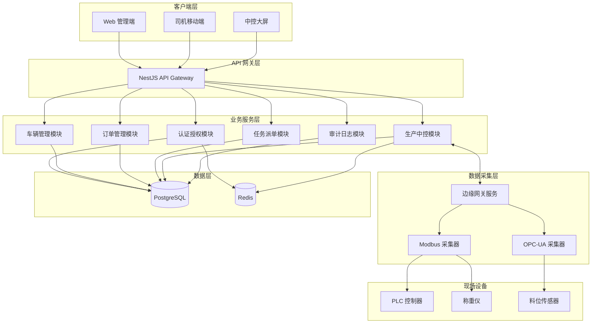
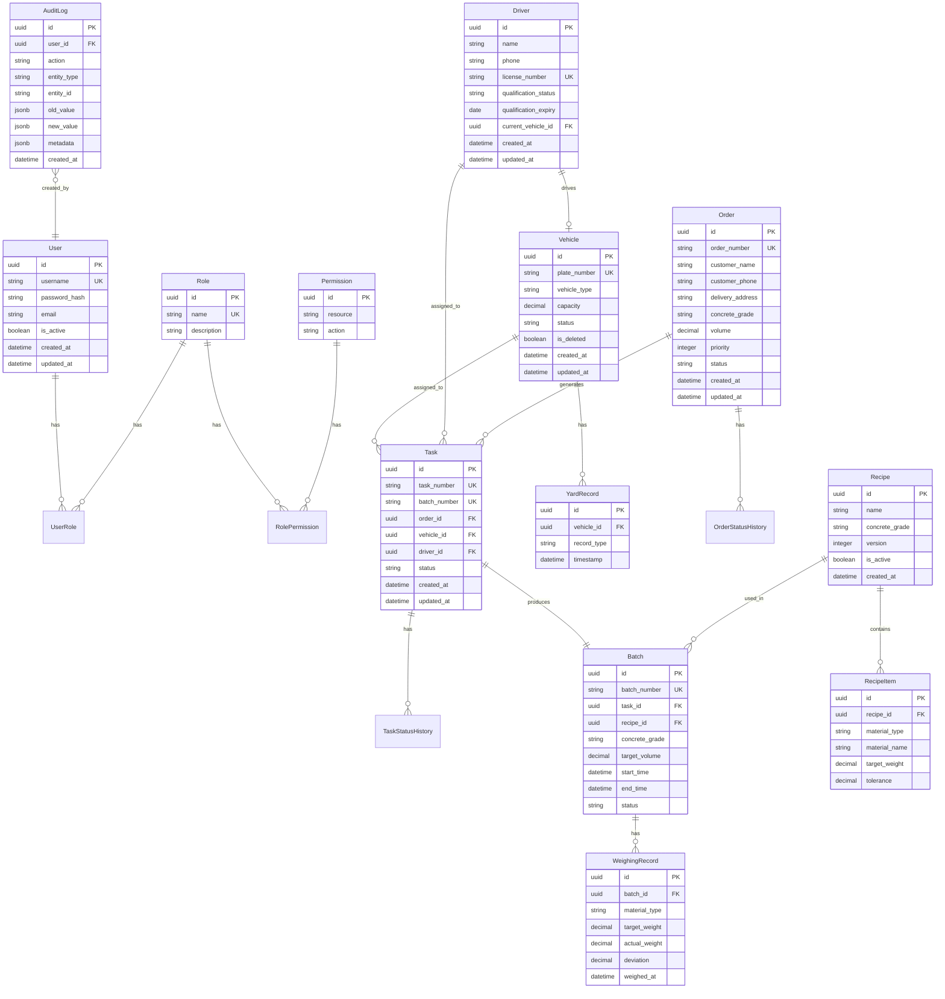

# Design Document: 混凝土搅拌站数字生命管控平台

## Overview

本设计文档描述混凝土搅拌站数字生命管控平台的技术架构和实现方案。系统采用 Node.js + TypeScript + NestJS 构建模块化单体架构，支持后续拆分为微服务。

### 技术栈选型

- **后端框架**: NestJS (基于 Express/Fastify)
- **语言**: TypeScript 5.x
- **数据库**: PostgreSQL 15+ (业务数据) + Redis 7+ (缓存/队列)
- **ORM**: Prisma
- **实时通信**: Socket.io (WebSocket)
- **设备通信**: node-modbus (Modbus TCP/RTU), node-opcua (OPC-UA)
- **API 文档**: Swagger/OpenAPI 3.0
- **认证**: JWT + Passport.js
- **容器化**: Docker + Docker Compose
- **测试**: Jest + fast-check (属性测试)

## Architecture

### 系统架构图



### 模块划分

| 模块 | 职责 | 依赖 |
|------|------|------|
| AuthModule | 用户认证、JWT 签发、RBAC 权限 | Redis, PostgreSQL |
| VehicleModule | 车辆档案、司机管理、进出场 | PostgreSQL |
| OrderModule | 订单 CRUD、状态流转 | PostgreSQL |
| TaskModule | 任务派单、状态追踪 | PostgreSQL, VehicleModule |
| ProductionModule | 中控可视化、设备数据、配方管理 | PostgreSQL, Redis, EdgeGateway |
| AuditModule | 审计日志记录与查询 | PostgreSQL |
| EdgeGatewayModule | 设备通信、数据采集、离线缓存 | Redis, Modbus, OPC-UA |

## Components and Interfaces

### 1. 认证授权模块 (AuthModule)

```typescript
// 用户认证接口
interface IAuthService {
  login(credentials: LoginDto): Promise<TokenResponse>;
  validateToken(token: string): Promise<UserPayload>;
  refreshToken(refreshToken: string): Promise<TokenResponse>;
  logout(userId: string): Promise<void>;
}

// 权限检查接口
interface IPermissionService {
  checkPermission(userId: string, resource: string, action: string): Promise<boolean>;
  getUserRoles(userId: string): Promise<Role[]>;
  assignRole(userId: string, roleId: string): Promise<void>;
}

// DTO 定义
interface LoginDto {
  username: string;
  password: string;
}

interface TokenResponse {
  accessToken: string;
  refreshToken: string;
  expiresIn: number;
}

interface UserPayload {
  userId: string;
  username: string;
  roles: string[];
}
```

### 2. 车辆管理模块 (VehicleModule)

```typescript
// 车辆服务接口
interface IVehicleService {
  create(data: CreateVehicleDto): Promise<Vehicle>;
  findById(id: string): Promise<Vehicle | null>;
  findAll(query: VehicleQueryDto): Promise<PaginatedResult<Vehicle>>;
  update(id: string, data: UpdateVehicleDto): Promise<Vehicle>;
  softDelete(id: string): Promise<void>;
  updateStatus(id: string, status: VehicleStatus): Promise<Vehicle>;
}

// 司机服务接口
interface IDriverService {
  create(data: CreateDriverDto): Promise<Driver>;
  findById(id: string): Promise<Driver | null>;
  findAll(query: DriverQueryDto): Promise<PaginatedResult<Driver>>;
  update(id: string, data: UpdateDriverDto): Promise<Driver>;
  assignToVehicle(driverId: string, vehicleId: string): Promise<void>;
  checkQualification(driverId: string): Promise<boolean>;
}

// 进出场服务接口
interface IYardService {
  recordEntry(vehicleId: string, timestamp?: Date): Promise<YardRecord>;
  recordExit(vehicleId: string, timestamp?: Date): Promise<YardRecord>;
  getQueue(): Promise<QueuedVehicle[]>;
  estimateWaitTime(vehicleId: string): Promise<number>;
}

// 枚举定义
enum VehicleStatus {
  AVAILABLE = 'available',
  IN_TRANSIT = 'in_transit',
  LOADING = 'loading',
  MAINTENANCE = 'maintenance',
  OFFLINE = 'offline'
}

enum DriverQualificationStatus {
  QUALIFIED = 'qualified',
  EXPIRED = 'expired',
  SUSPENDED = 'suspended'
}
```

### 3. 订单管理模块 (OrderModule)

```typescript
// 订单服务接口
interface IOrderService {
  create(data: CreateOrderDto): Promise<Order>;
  findById(id: string): Promise<Order | null>;
  findAll(query: OrderQueryDto): Promise<PaginatedResult<Order>>;
  update(id: string, data: UpdateOrderDto): Promise<Order>;
  transitionStatus(id: string, newStatus: OrderStatus, operatorId: string): Promise<Order>;
  generateOrderNumber(): string;
}

// 订单状态机
enum OrderStatus {
  PENDING = 'pending',
  CONFIRMED = 'confirmed',
  IN_PRODUCTION = 'in_production',
  DISPATCHED = 'dispatched',
  DELIVERED = 'delivered',
  COMPLETED = 'completed',
  CANCELLED = 'cancelled'
}

// 状态转换规则
const ORDER_STATUS_TRANSITIONS: Record<OrderStatus, OrderStatus[]> = {
  [OrderStatus.PENDING]: [OrderStatus.CONFIRMED, OrderStatus.CANCELLED],
  [OrderStatus.CONFIRMED]: [OrderStatus.IN_PRODUCTION, OrderStatus.CANCELLED],
  [OrderStatus.IN_PRODUCTION]: [OrderStatus.DISPATCHED],
  [OrderStatus.DISPATCHED]: [OrderStatus.DELIVERED],
  [OrderStatus.DELIVERED]: [OrderStatus.COMPLETED],
  [OrderStatus.COMPLETED]: [],
  [OrderStatus.CANCELLED]: []
};
```

### 4. 任务派单模块 (TaskModule)

```typescript
// 任务服务接口
interface ITaskService {
  createFromOrder(orderId: string, data: CreateTaskDto): Promise<Task>;
  findById(id: string): Promise<Task | null>;
  findAll(query: TaskQueryDto): Promise<PaginatedResult<Task>>;
  assignVehicle(taskId: string, vehicleId: string, driverId: string): Promise<Task>;
  transitionStatus(id: string, newStatus: TaskStatus, location?: GeoPoint): Promise<Task>;
  generateBatchNumber(): string;
}

// 任务状态机
enum TaskStatus {
  CREATED = 'created',
  ASSIGNED = 'assigned',
  LOADING = 'loading',
  IN_TRANSIT = 'in_transit',
  DELIVERED = 'delivered',
  RETURNED = 'returned',
  CANCELLED = 'cancelled'
}

// 状态转换规则
const TASK_STATUS_TRANSITIONS: Record<TaskStatus, TaskStatus[]> = {
  [TaskStatus.CREATED]: [TaskStatus.ASSIGNED, TaskStatus.CANCELLED],
  [TaskStatus.ASSIGNED]: [TaskStatus.LOADING, TaskStatus.CANCELLED],
  [TaskStatus.LOADING]: [TaskStatus.IN_TRANSIT],
  [TaskStatus.IN_TRANSIT]: [TaskStatus.DELIVERED],
  [TaskStatus.DELIVERED]: [TaskStatus.RETURNED],
  [TaskStatus.RETURNED]: [],
  [TaskStatus.CANCELLED]: []
};
```

### 5. 生产中控模块 (ProductionModule)

```typescript
// 设备状态接口
interface IProductionService {
  getPlantStatus(): Promise<PlantStatus>;
  getBinStatus(binId: string): Promise<BinStatus>;
  getAllBinsStatus(): Promise<BinStatus[]>;
  getScaleReading(scaleId: string): Promise<ScaleReading>;
  getMixerStatus(): Promise<MixerStatus>;
  getCurrentBatch(): Promise<BatchInfo | null>;
  getProductionLog(query: ProductionLogQuery): Promise<PaginatedResult<ProductionRecord>>;
}

// 配方服务接口
interface IRecipeService {
  create(data: CreateRecipeDto): Promise<Recipe>;
  findById(id: string): Promise<Recipe | null>;
  findByGrade(grade: string): Promise<Recipe[]>;
  update(id: string, data: UpdateRecipeDto): Promise<Recipe>;
  activate(id: string): Promise<Recipe>;
  getActiveRecipe(grade: string): Promise<Recipe | null>;
}

// 设备状态类型
interface PlantStatus {
  online: boolean;
  lastUpdate: Date;
  aggregateBins: BinStatus[];
  cementSilos: SiloStatus[];
  additiveTanks: TankStatus[];
  scales: ScaleReading[];
  mixer: MixerStatus;
  currentBatch: BatchInfo | null;
}

interface BinStatus {
  id: string;
  name: string;
  specification: string;  // e.g., "5-10mm", "10-20mm"
  currentWeight: number;  // kg
  capacity: number;       // kg
  percentage: number;     // 0-100
  lowLevelAlarm: boolean;
  discharging: boolean;
}

interface SiloStatus {
  id: string;
  name: string;
  materialType: string;   // e.g., "P.O 42.5", "矿粉"
  currentWeight: number;  // tons
  capacity: number;       // tons
  percentage: number;
  lowLevelAlarm: boolean;
}

interface TankStatus {
  id: string;
  name: string;
  materialType: string;   // e.g., "水", "减水剂"
  currentVolume: number;  // liters
  capacity: number;
  percentage: number;
  pumpRunning: boolean;
}

interface ScaleReading {
  id: string;
  name: string;
  materialType: string;
  targetWeight: number;
  actualWeight: number;
  deviation: number;      // percentage
  status: 'idle' | 'weighing' | 'complete' | 'error';
}

interface MixerStatus {
  id: string;
  running: boolean;
  currentTime: number;    // seconds
  totalTime: number;      // seconds
  loadPercentage: number;
  dischargeGateOpen: boolean;
}

interface BatchInfo {
  batchNumber: string;
  taskNumber: string;
  concreteGrade: string;
  targetVolume: number;   // m³
  recipe: RecipeSummary;
  startTime: Date;
  status: 'preparing' | 'weighing' | 'mixing' | 'discharging' | 'complete';
}
```

### 6. 边缘网关模块 (EdgeGatewayModule)

```typescript
// 设备通信接口
interface IDeviceConnector {
  connect(): Promise<void>;
  disconnect(): Promise<void>;
  isConnected(): boolean;
  readRegister(address: number, length: number): Promise<number[]>;
  writeRegister(address: number, values: number[]): Promise<void>;
}

// Modbus 配置
interface ModbusConfig {
  host: string;
  port: number;
  unitId: number;
  timeout: number;
  retryCount: number;
}

// 数据点映射
interface DataPointMapping {
  id: string;
  name: string;
  protocol: 'modbus' | 'opcua';
  address: string;        // Modbus: "40001", OPC-UA: "ns=2;s=Channel1.Device1.Tag1"
  dataType: 'int16' | 'int32' | 'float' | 'boolean';
  scale: number;          // 缩放因子
  unit: string;
  pollInterval: number;   // ms
}

// 离线缓存接口
interface IOfflineCache {
  store(dataPoint: string, value: any, timestamp: Date): Promise<void>;
  getUnsynced(): Promise<CachedData[]>;
  markSynced(ids: string[]): Promise<void>;
  clear(): Promise<void>;
}
```

### 7. 审计日志模块 (AuditModule)

```typescript
// 审计服务接口
interface IAuditService {
  log(entry: AuditEntry): Promise<void>;
  query(filter: AuditQueryDto): Promise<PaginatedResult<AuditLog>>;
}

interface AuditEntry {
  userId: string;
  action: AuditAction;
  entityType: string;
  entityId: string;
  oldValue?: any;
  newValue?: any;
  metadata?: Record<string, any>;
}

enum AuditAction {
  CREATE = 'create',
  UPDATE = 'update',
  DELETE = 'delete',
  LOGIN = 'login',
  LOGOUT = 'logout',
  STATUS_CHANGE = 'status_change'
}
```

## Data Models

### 数据库 ER 图



### Prisma Schema 核心定义

```prisma
model User {
  id           String     @id @default(uuid())
  username     String     @unique
  passwordHash String     @map("password_hash")
  email        String?
  isActive     Boolean    @default(true) @map("is_active")
  createdAt    DateTime   @default(now()) @map("created_at")
  updatedAt    DateTime   @updatedAt @map("updated_at")
  
  roles        UserRole[]
  auditLogs    AuditLog[]
  
  @@map("users")
}

model Vehicle {
  id          String        @id @default(uuid())
  plateNumber String        @unique @map("plate_number")
  vehicleType String        @map("vehicle_type")
  capacity    Decimal       @db.Decimal(10, 2)
  status      VehicleStatus @default(AVAILABLE)
  isDeleted   Boolean       @default(false) @map("is_deleted")
  createdAt   DateTime      @default(now()) @map("created_at")
  updatedAt   DateTime      @updatedAt @map("updated_at")
  
  tasks       Task[]
  yardRecords YardRecord[]
  driver      Driver?
  
  @@map("vehicles")
}

model Order {
  id              String      @id @default(uuid())
  orderNumber     String      @unique @map("order_number")
  customerName    String      @map("customer_name")
  customerPhone   String?     @map("customer_phone")
  deliveryAddress String      @map("delivery_address")
  concreteGrade   String      @map("concrete_grade")
  volume          Decimal     @db.Decimal(10, 2)
  priority        Int         @default(0)
  status          OrderStatus @default(PENDING)
  createdAt       DateTime    @default(now()) @map("created_at")
  updatedAt       DateTime    @updatedAt @map("updated_at")
  
  tasks           Task[]
  statusHistory   OrderStatusHistory[]
  
  @@map("orders")
}

model Task {
  id          String     @id @default(uuid())
  taskNumber  String     @unique @map("task_number")
  batchNumber String     @unique @map("batch_number")
  orderId     String     @map("order_id")
  vehicleId   String?    @map("vehicle_id")
  driverId    String?    @map("driver_id")
  status      TaskStatus @default(CREATED)
  createdAt   DateTime   @default(now()) @map("created_at")
  updatedAt   DateTime   @updatedAt @map("updated_at")
  
  order         Order              @relation(fields: [orderId], references: [id])
  vehicle       Vehicle?           @relation(fields: [vehicleId], references: [id])
  driver        Driver?            @relation(fields: [driverId], references: [id])
  batch         Batch?
  statusHistory TaskStatusHistory[]
  
  @@map("tasks")
}

enum VehicleStatus {
  AVAILABLE
  IN_TRANSIT
  LOADING
  MAINTENANCE
  OFFLINE
}

enum OrderStatus {
  PENDING
  CONFIRMED
  IN_PRODUCTION
  DISPATCHED
  DELIVERED
  COMPLETED
  CANCELLED
}

enum TaskStatus {
  CREATED
  ASSIGNED
  LOADING
  IN_TRANSIT
  DELIVERED
  RETURNED
  CANCELLED
}
```

## WebSocket Events

### 事件规范

```typescript
// 服务端 -> 客户端事件
interface ServerEvents {
  // 设备状态更新
  'plant:status': (status: PlantStatus) => void;
  'bin:update': (bin: BinStatus) => void;
  'scale:update': (scale: ScaleReading) => void;
  'mixer:update': (mixer: MixerStatus) => void;
  
  // 生产事件
  'batch:started': (batch: BatchInfo) => void;
  'batch:completed': (batch: BatchInfo) => void;
  
  // 告警事件
  'alarm:triggered': (alarm: AlarmEvent) => void;
  'alarm:cleared': (alarmId: string) => void;
  
  // 车辆事件
  'vehicle:entered': (record: YardRecord) => void;
  'vehicle:exited': (record: YardRecord) => void;
  'queue:updated': (queue: QueuedVehicle[]) => void;
}

// 客户端 -> 服务端事件
interface ClientEvents {
  'subscribe:plant': (plantId: string) => void;
  'unsubscribe:plant': (plantId: string) => void;
  'subscribe:vehicle': (vehicleId: string) => void;
}
```

## Error Handling

### 错误码定义

```typescript
enum ErrorCode {
  // 认证错误 (1xxx)
  INVALID_CREDENTIALS = 1001,
  TOKEN_EXPIRED = 1002,
  TOKEN_INVALID = 1003,
  PERMISSION_DENIED = 1004,
  
  // 车辆错误 (2xxx)
  VEHICLE_NOT_FOUND = 2001,
  VEHICLE_PLATE_EXISTS = 2002,
  VEHICLE_NOT_AVAILABLE = 2003,
  
  // 司机错误 (3xxx)
  DRIVER_NOT_FOUND = 3001,
  DRIVER_LICENSE_EXISTS = 3002,
  DRIVER_NOT_QUALIFIED = 3003,
  
  // 订单错误 (4xxx)
  ORDER_NOT_FOUND = 4001,
  ORDER_INVALID_TRANSITION = 4002,
  
  // 任务错误 (5xxx)
  TASK_NOT_FOUND = 5001,
  TASK_INVALID_TRANSITION = 5002,
  TASK_ALREADY_ASSIGNED = 5003,
  
  // 设备错误 (6xxx)
  DEVICE_CONNECTION_FAILED = 6001,
  DEVICE_READ_ERROR = 6002,
  DEVICE_WRITE_ERROR = 6003,
  
  // 通用错误 (9xxx)
  VALIDATION_ERROR = 9001,
  INTERNAL_ERROR = 9999
}

// 统一错误响应格式
interface ErrorResponse {
  success: false;
  error: {
    code: ErrorCode;
    message: string;
    details?: any;
  };
  traceId: string;
  timestamp: string;
}
```


## Correctness Properties

*A property is a characteristic or behavior that should hold true across all valid executions of a system—essentially, a formal statement about what the system should do. Properties serve as the bridge between human-readable specifications and machine-verifiable correctness guarantees.*

### Property 1: JWT Token Issuance

*For any* valid user credentials (username and password matching a user in the database), calling the login endpoint SHALL return a response containing an accessToken, refreshToken, and expiresIn field where expiresIn is a positive number.

**Validates: Requirements 1.1**

### Property 2: Invalid Credentials Rejection

*For any* credentials where either username does not exist or password does not match, calling the login endpoint SHALL return HTTP status 401 and the response body SHALL contain an error code.

**Validates: Requirements 1.2**

### Property 3: Invalid Token Rejection

*For any* JWT token that is expired, malformed, or has an invalid signature, calling any protected endpoint with that token SHALL return HTTP status 401.

**Validates: Requirements 1.3**

### Property 4: Permission Enforcement

*For any* authenticated user without the required permission for a resource, attempting to access that resource SHALL return HTTP status 403.

**Validates: Requirements 1.5**

### Property 5: Authentication Logging

*For any* authentication attempt (successful or failed), an audit log entry SHALL be created containing timestamp, user identifier (or attempted username), and result (success/failure).

**Validates: Requirements 1.6**

### Property 6: Entity Creation Completeness

*For any* valid entity creation request (Vehicle, Driver, Order, Task), the created entity SHALL contain all provided fields, and retrieving the entity by ID SHALL return the same field values.

**Validates: Requirements 2.1, 3.1, 4.1, 5.1**

### Property 7: Query Filtering Correctness

*For any* query with filter parameters, all returned entities SHALL match the filter criteria. If filtering by status, all results SHALL have that status. If filtering by date range, all results SHALL have timestamps within that range.

**Validates: Requirements 2.2, 3.2, 4.3, 5.5**

### Property 8: Soft Delete Preservation

*For any* deleted vehicle, the database record SHALL still exist with isDeleted=true, and the vehicle SHALL NOT appear in normal queries but SHALL be retrievable through admin/audit queries.

**Validates: Requirements 2.4**

### Property 9: Unique Constraint Enforcement

*For any* attempt to create an entity with a duplicate unique field (vehicle plate number, driver license number, order number, task number), the operation SHALL fail with a validation error and no new record SHALL be created.

**Validates: Requirements 2.5, 3.6, 4.2, 5.2**

### Property 10: Order State Machine Validity

*For any* order, status transitions SHALL only succeed if the transition is valid according to the state machine (pending→confirmed→in_production→dispatched→delivered→completed). Invalid transitions SHALL be rejected with an error, and a status history record SHALL be created for each successful transition.

**Validates: Requirements 4.4, 4.5, 4.6**

### Property 11: Task State Machine Validity

*For any* task, status transitions SHALL only succeed if the transition is valid according to the state machine (created→assigned→loading→in_transit→delivered→returned). Each successful transition SHALL create a status history record with timestamp and operator.

**Validates: Requirements 5.3, 5.4**

### Property 12: Task Assignment Validation

*For any* task assignment, the operation SHALL fail if the vehicle status is not 'available' OR if the driver qualification status is not 'qualified'. The error response SHALL indicate the specific validation failure.

**Validates: Requirements 5.6, 5.7, 3.5**

### Property 13: Yard Record Completeness

*For any* vehicle entry or exit event, a YardRecord SHALL be created with the correct record_type ('entry' or 'exit'), timestamp, and vehicle_id. The vehicle's location status SHALL be updated accordingly.

**Validates: Requirements 6.1, 6.2**

### Property 14: Queue Ordering

*For any* query of the vehicle queue, the returned list SHALL be ordered by entry timestamp in ascending order (earliest entry first).

**Validates: Requirements 6.4**

### Property 15: API Response Consistency

*For any* API response, the response SHALL be valid JSON, all datetime fields SHALL be in ISO 8601 format, paginated responses SHALL include page, limit, and total fields, and all responses SHALL include a traceId field.

**Validates: Requirements 7.2, 7.3, 7.6, 7.7**

### Property 16: Validation Error Response

*For any* request that fails validation (missing required fields, invalid format, out of range values), the response SHALL have HTTP status 400 and SHALL include an error object with code and message describing the validation failure.

**Validates: Requirements 7.4**

### Property 17: Audit Log Completeness

*For any* create, update, or delete operation on a business entity, an audit log entry SHALL be created containing: timestamp, userId, action type, entityType, entityId, and for updates, both oldValue and newValue.

**Validates: Requirements 9.1, 9.2**

### Property 18: Plant Status Completeness

*For any* call to getPlantStatus(), the response SHALL include: all configured aggregate bins with currentWeight and percentage, all cement silos with currentWeight, all additive tanks with currentVolume, all scales with targetWeight and actualWeight, and mixer status with running state, currentTime, and dischargeGateOpen.

**Validates: Requirements 11.2, 11.3, 12.2, 13.2, 14.1, 15.1, 15.2, 15.3, 15.5**

### Property 19: Low Inventory Alarm

*For any* storage bin (aggregate, cement, or additive), when the current level falls below the configured threshold percentage, the lowLevelAlarm flag SHALL be true. When the level is at or above the threshold, lowLevelAlarm SHALL be false.

**Validates: Requirements 11.5, 12.5**

### Property 20: Deviation Calculation

*For any* weighing record, the deviation SHALL be calculated as ((actualWeight - targetWeight) / targetWeight) * 100. When the absolute deviation exceeds the configured tolerance, a warning flag SHALL be set.

**Validates: Requirements 16.4, 16.5**

### Property 21: Production Log Completeness

*For any* production log entry, the record SHALL contain: batchNumber, timestamp, concreteGrade, targetVolume, and vehiclePlateNumber. Filtering by time range SHALL return only records within that range.

**Validates: Requirements 17.1, 17.2, 17.4**

### Property 22: Device Error Handling

*For any* device communication failure, the system SHALL: set the device connection status to 'error', return cached last-known values for data points, log the error with timestamp and device identifier, and automatically retry connection.

**Validates: Requirements 18.4, 18.5, 18.6**

## Testing Strategy

### 测试框架选型

- **单元测试**: Jest
- **属性测试**: fast-check (Property-Based Testing)
- **集成测试**: Jest + Supertest
- **E2E 测试**: Jest + Supertest

### 双重测试方法

本项目采用单元测试与属性测试相结合的方式：

1. **单元测试**: 验证具体示例、边界情况和错误条件
2. **属性测试**: 验证跨所有输入的通用属性

两种测试互补，共同提供全面的覆盖：
- 单元测试捕获具体的 bug
- 属性测试验证通用的正确性

### 属性测试配置

```typescript
// jest.config.js
module.exports = {
  testTimeout: 30000, // 属性测试需要更长时间
  // ...
};

// 属性测试示例
import * as fc from 'fast-check';

describe('Order State Machine', () => {
  // Feature: concrete-plant-platform, Property 10: Order State Machine Validity
  it('should only allow valid state transitions', () => {
    fc.assert(
      fc.property(
        fc.constantFrom(...Object.values(OrderStatus)),
        fc.constantFrom(...Object.values(OrderStatus)),
        (fromStatus, toStatus) => {
          const isValidTransition = ORDER_STATUS_TRANSITIONS[fromStatus]?.includes(toStatus) ?? false;
          const result = orderService.canTransition(fromStatus, toStatus);
          return result === isValidTransition;
        }
      ),
      { numRuns: 100 }
    );
  });
});
```

### 测试覆盖要求

| 模块 | 单元测试 | 属性测试 | 集成测试 |
|------|----------|----------|----------|
| AuthModule | ✓ | P1-P5 | ✓ |
| VehicleModule | ✓ | P6-P9, P13-P14 | ✓ |
| OrderModule | ✓ | P6-P7, P9-P10 | ✓ |
| TaskModule | ✓ | P6-P7, P9, P11-P12 | ✓ |
| ProductionModule | ✓ | P18-P21 | ✓ |
| AuditModule | ✓ | P17 | ✓ |
| EdgeGatewayModule | ✓ | P22 | ✓ |
| API Layer | ✓ | P15-P16 | ✓ |

### 测试数据生成器

```typescript
// 使用 fast-check 生成测试数据
const vehicleArbitrary = fc.record({
  plateNumber: fc.stringOf(fc.constantFrom(...'ABCDEFGHIJKLMNOPQRSTUVWXYZ0123456789'), { minLength: 7, maxLength: 8 }),
  vehicleType: fc.constantFrom('mixer', 'pump', 'transport'),
  capacity: fc.float({ min: 1, max: 20, noNaN: true }),
  status: fc.constantFrom(...Object.values(VehicleStatus))
});

const orderArbitrary = fc.record({
  customerName: fc.string({ minLength: 1, maxLength: 100 }),
  deliveryAddress: fc.string({ minLength: 1, maxLength: 500 }),
  concreteGrade: fc.constantFrom('C15', 'C20', 'C25', 'C30', 'C35', 'C40'),
  volume: fc.float({ min: 0.5, max: 100, noNaN: true }),
  priority: fc.integer({ min: 0, max: 10 })
});
```

### CI/CD 集成

```yaml
# .github/workflows/test.yml
name: Test
on: [push, pull_request]
jobs:
  test:
    runs-on: ubuntu-latest
    services:
      postgres:
        image: postgres:15
        env:
          POSTGRES_PASSWORD: test
        ports:
          - 5432:5432
      redis:
        image: redis:7
        ports:
          - 6379:6379
    steps:
      - uses: actions/checkout@v3
      - uses: actions/setup-node@v3
        with:
          node-version: '20'
      - run: npm ci
      - run: npm run test:unit
      - run: npm run test:property
      - run: npm run test:integration
      - run: npm run test:e2e
```
